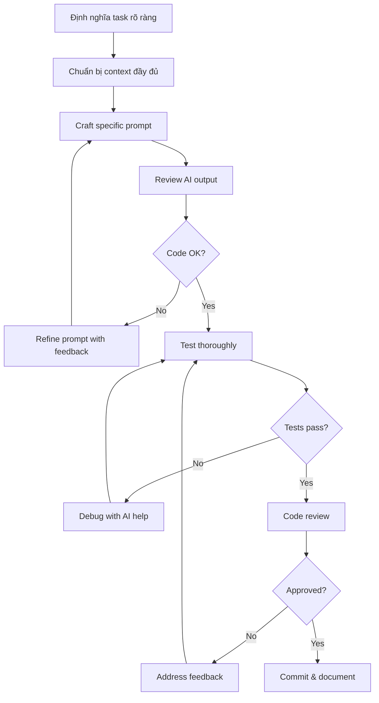

# Hướng Dẫn Làm Việc Với AI Coding Agent

> 🤖 **Mục đích**: Tối ưu hóa collaboration giữa developers và AI  
> 🎯 **Áp dụng cho**: GitHub Copilot, ChatGPT, Claude, và các AI coding assistants  
> 🚀 **Mục tiêu**: Tăng năng suất, giảm bugs, cải thiện chất lượng code

---

## 📋 Mục Lục
1. [Prompting Best Practices](#prompting-best-practices)
2. [Context Management](#context-management)
3. [Code Review với AI](#code-review-với-ai)
4. [Debugging với AI](#debugging-với-ai)
5. [Refactoring Guidelines](#refactoring-guidelines)
6. [Testing với AI](#testing-với-ai)
7. [Common Pitfalls](#common-pitfalls)

---

## 1. Prompting Best Practices

### Cấu Trúc Prompt Hiệu Quả

#### Template Chung
```
[Context] + [Task] + [Requirements] + [Constraints] + [Output Format]
```

#### Ví Dụ Tốt

**❌ SAI - Quá chung chung:**
```
"Tạo API cho messages"
```

**✅ ĐÚNG - Cụ thể và rõ ràng:**
```
Context: Fruvia Chat app, Spring Boot 3.x, JWT authentication
Task: Tạo REST API để gửi tin nhắn trong conversation
Requirements:
- POST /api/v1/messages
- Validate message content (max 5000 chars)
- Lấy senderId từ JWT token
- Trả về 201 CREATED với MessageResponse
- Include error handling
Constraints:
- Dùng MessageService.sendMessage()
- Follow project naming conventions
- Include JavaDoc
Output: Controller method với tests
```

### Prompt Templates Cho Các Tasks Thường Gặp

#### 🔨 Tạo Feature Mới
```
Tạo [feature name] cho Fruvia Chat Backend

Context:
- Spring Boot 3.x project
- Package structure: iuh.fit.[feature]
- JWT authentication đã có
- Database: PostgreSQL/MySQL

Requirements:
1. Entity với các fields: [list fields]
2. Repository với queries: [list queries]
3. Service với business logic: [describe logic]
4. Controller với endpoints: [list endpoints]
5. DTOs cho request/response

Follow:
- docs/RULE_BACKEND.md conventions
- Include validation
- Add error handling
- Write unit tests
```

#### 🐛 Fix Bug
```
Debug lỗi: [tên lỗi hoặc error message]

Context:
- File: [đường dẫn file]
- Method: [tên method]
- Expected behavior: [hành vi mong đợi]
- Actual behavior: [hành vi thực tế]

Error details:
[Paste stack trace hoặc error logs]

Constraints:
- Không thay đổi API contracts
- Maintain backward compatibility
```

#### 🧪 Viết Tests
```
Viết unit tests cho [class/method name]

Context:
- Class under test: [tên class]
- Dependencies: [list dependencies cần mock]
- Test framework: JUnit 5 + Mockito

Test cases cần cover:
1. Happy path: [mô tả]
2. Edge cases: [list các edge cases]
3. Error scenarios: [list error scenarios]

Requirements:
- Minimum 90% coverage
- Use @ExtendWith(MockitoExtension.class)
- Follow AAA pattern (Arrange-Act-Assert)
```

---

## 2. Context Management

### Cung Cấp Context Đầy Đủ

#### Thông Tin Cần Thiết
```
Project Context:
- Framework: Spring Boot 3.x
- Java Version: 17+
- Build Tool: Maven
- Database: PostgreSQL
- Authentication: JWT (HMAC-SHA512)

Current Implementation:
[Paste relevant code hoặc link đến files]

Related Files:
- Entity: src/main/java/iuh/fit/entity/Message.java
- Service: src/main/java/iuh/fit/service/MessageService.java
- Repository: src/main/java/iuh/fit/repository/MessageRepository.java

Conventions:
- Follow docs/RULE_BACKEND.md
- Use Utils from iuh.fit.utils package
```

### File References

**✅ ĐÚNG - Link trực tiếp:**
```
Tham khảo implementation trong:
- src/main/java/iuh/fit/controller/UserController.java (lines 45-67)
- src/main/java/iuh/fit/service/impl/UserServiceImpl.java
- docs/SECURITY_ARCHITECTURE.md (JWT section)
```

**❌ SAI - References mơ hồ:**
```
"Xem file controller kia"
"Dựa theo user service"
```

---

## 3. Code Review với AI

### Prompt Template

```
Code Review Request

File: [file path]
Changes: [mô tả thay đổi]

[Paste code changes]

Review checklist:
1. Naming conventions (docs/RULE_BACKEND.md)
2. Error handling đầy đủ chưa?
3. Security issues (input validation, authorization)
4. Performance concerns (N+1 queries, unnecessary loops)
5. Test coverage
6. Documentation (JavaDoc)

Provide:
- ✅ Approved / ❌ Changes Requested
- List issues found (Critical/Major/Minor)
- Suggestions với code examples
```

### AI Review Response Format

```
## Code Review Results

### Status: ❌ Changes Requested

### Issues Found:

**🔴 Critical:**
1. **Missing Authorization Check** (Line 23)
   - User có thể delete messages của người khác
   - Fix: Add ownership verification
   ```java
   if (!message.getSender().getId().equals(currentUserId)) {
       throw new UnauthorizedAccessException("Cannot delete others' messages");
   }
   ```

**🟡 Major:**
2. **N+1 Query Problem** (Line 45)
   - Fetching conversations trong loop
   - Fix: Use @EntityGraph hoặc JOIN FETCH

**🟢 Minor:**
3. **Missing JavaDoc** (Line 10)
   - Public method cần JavaDoc
   - Add description, @param, @return, @throws

### Approved Aspects:
✅ Naming conventions followed
✅ Input validation present
✅ Error responses formatted correctly
```

---

## 4. Debugging với AI

### Prompt Template

```
Debug Help Needed

Problem: [Mô tả vấn đề ngắn gọn]

Expected: [Hành vi mong đợi]
Actual: [Hành vi thực tế]

Error Message:
```
[Paste full error message/stack trace]
```

Code Context:
```java
[Paste relevant code - 20-30 lines around error point]
```

What I've Tried:
1. [Action 1] - [Result]
2. [Action 2] - [Result]

Environment:
- Spring Boot version: 3.x
- Java version: 17
- Database: PostgreSQL 15

Request:
1. Identify root cause
2. Provide step-by-step fix
3. Explain why the error occurred
4. Suggest prevention strategies
```

### Debugging Strategies với AI

#### 1. Stack Trace Analysis
```
Phân tích stack trace này:

[Paste full stack trace]

Questions:
1. Dòng nào gây ra lỗi?
2. Root cause là gì?
3. Related code cần check ở đâu?
4. Fix suggestion?
```

#### 2. Logic Debugging
```
Logic issue trong method này:

```java
[Paste method code]
```

Test case failed:
- Input: [test input]
- Expected output: [expected]
- Actual output: [actual]

Walk through logic step-by-step và identify issue.
```

---

## 5. Refactoring Guidelines

### Refactoring Request Template

```
Refactor Request

Current Code:
```java
[Paste code cần refactor]
```

Issues:
1. [Issue 1: e.g., Too many responsibilities]
2. [Issue 2: e.g., Duplicate logic]
3. [Issue 3: e.g., Hard to test]

Goals:
- Improve readability
- Reduce complexity
- Maintain functionality (no behavior changes)
- Follow SOLID principles

Constraints:
- Keep existing API contracts
- Don't break tests
- Follow docs/RULE_BACKEND.md

Output:
- Refactored code
- Explanation of changes
- Updated tests
```

### Refactoring Checklist

```
Pre-Refactoring:
- [ ] Có tests đầy đủ chưa?
- [ ] Tests pass không?
- [ ] Commit current working state

Post-Refactoring:
- [ ] All tests still pass
- [ ] Code coverage maintained/improved
- [ ] No new warnings
- [ ] Documentation updated
- [ ] Behavior không thay đổi
```

---

## 6. Testing với AI

### Test Generation Template

```
Generate Unit Tests

Class Under Test:
```java
[Paste class code]
```

Test Requirements:
1. Framework: JUnit 5 + Mockito
2. Coverage target: 90%+
3. Naming: should_ExpectedBehavior_When_Condition

Test Scenarios:
- Happy path: [describe]
- Edge cases: [list]
  * Empty input
  * Null values
  * Boundary values
- Error cases: [list]
  * Invalid input
  * Unauthorized access
  * Not found scenarios

Mock Dependencies:
- [Dependency 1]
- [Dependency 2]

Output Format:
```java
@ExtendWith(MockitoExtension.class)
class ClassNameTest {
    // Tests here
}
```
```

### Test Case Template

```java
/**
 * Test: [Mô tả test case]
 * Given: [Preconditions/setup]
 * When: [Action being tested]
 * Then: [Expected outcome]
 */
@Test
void should_ReturnMessage_When_ValidInputProvided() {
    // Given (Arrange)
    String userId = "user123";
    MessageRequest request = new MessageRequest();
    request.setContent("Hello");
    
    Message expectedMessage = new Message();
    expectedMessage.setId("msg123");
    
    when(messageRepository.save(any(Message.class)))
        .thenReturn(expectedMessage);
    
    // When (Act)
    Message result = messageService.sendMessage(userId, request);
    
    // Then (Assert)
    assertNotNull(result);
    assertEquals("msg123", result.getId());
    verify(messageRepository, times(1)).save(any(Message.class));
}
```

---

## 7. Common Pitfalls

### ❌ Lỗi Thường Gặp Khi Dùng AI

#### 1. Over-reliance Without Understanding
```
❌ SAI:
"Generate code" → Copy/paste → Không hiểu code

✅ ĐÚNG:
"Generate code" → Review → Understand → Ask questions → Customize → Test
```

#### 2. Insufficient Context
```
❌ SAI:
"Fix bug in service"

✅ ĐÚNG:
"Fix NullPointerException in MessageService.sendMessage() 
when conversation doesn't exist. See error at line 45."
```

#### 3. Accepting Hallucinations
```
⚠️ AI có thể suggest:
- Non-existent methods/classes
- Wrong version APIs
- Outdated practices

✅ Always verify:
- Check documentation
- Test the code
- Review with team
```

#### 4. Ignoring Project Conventions
```
❌ AI generates generic code

✅ Provide constraints:
"Follow naming conventions in docs/RULE_BACKEND.md"
"Use existing Utils from iuh.fit.utils package"
"Match error handling pattern in UserController"
```

---

## 🎯 Workflow Tối Ưu

### Development Flow với AI



### Checklist Mỗi AI-Generated Code

```
Before Accepting:
- [ ] Understand code completely
- [ ] Follows project conventions
- [ ] Has proper error handling
- [ ] Includes validation
- [ ] Has JavaDoc/comments
- [ ] Tested (manual + unit tests)
- [ ] No security issues
- [ ] No performance issues

Before Committing:
- [ ] Code review passed
- [ ] Tests pass (mvn test)
- [ ] No new warnings
- [ ] Documentation updated
```

---

## 📚 Prompt Library

### Common Tasks

#### 1. Explain Code
```
Giải thích code này bằng tiếng Việt:

```java
[Paste code]
```

Cần hiểu:
1. Purpose of this code
2. How it works step-by-step
3. Why design decisions were made
4. Potential issues/improvements
```

#### 2. Performance Optimization
```
Optimize performance của method này:

```java
[Paste method]
```

Current issues:
- [Issue 1: e.g., Multiple DB queries]
- [Issue 2: e.g., Unnecessary loops]

Requirements:
- Maintain functionality
- Reduce query count
- Improve time complexity

Provide:
- Optimized code
- Performance comparison
- Explanation of improvements
```

#### 3. Security Review
```
Security audit cho code này:

```java
[Paste code]
```

Check for:
1. Input validation
2. SQL injection risks
3. XSS vulnerabilities
4. Authorization issues
5. Sensitive data exposure

Provide:
- List of security issues
- Severity (Critical/High/Medium/Low)
- Fix recommendations with code
```

---

## 🔄 Iteration Strategy

### Khi AI Response Không Đúng

1. **Làm rõ prompt hơn**
   ```
   "Generate API endpoint"
   ↓
   "Generate POST endpoint at /api/v1/messages that creates a message,
   validates input, requires authentication, returns 201 with MessageResponse"
   ```

2. **Cung cấp examples**
   ```
   "Follow pattern từ UserController.createUser():
   ```java
   [Paste example]
   ```
   Apply tương tự cho MessageController.createMessage()"
   ```

3. **Chia nhỏ task**
   ```
   Thay vì: "Build message feature"
   Làm từng bước:
   1. "Create Message entity"
   2. "Create MessageRepository"
   3. "Create MessageService"
   4. "Create MessageController"
   ```

---

## 💡 Pro Tips

### 1. Version Control với AI
```bash
# Before AI generation
git commit -m "Save working state before AI refactoring"

# After AI changes
git add .
git commit -m "refactor: apply AI suggestions for MessageService"
git tag ai-refactor-v1  # Easy rollback point
```

### 2. Document AI Decisions
```java
/**
 * Sends message in conversation.
 * 
 * Note: Implementation suggested by GitHub Copilot,
 * reviewed and modified to fit project requirements.
 * See: docs/RULE_BACKEND.md for conventions followed.
 */
public Message sendMessage(String userId, MessageRequest request) {
    // ...
}
```

### 3. Test AI Code Thoroughly
```java
// AI generates code -> Bạn viết comprehensive tests
@Test
void should_HandleEdgeCases_When_InputIsUnexpected() {
    // Test cases AI có thể miss:
    // - Null inputs
    // - Empty strings
    // - Very long strings
    // - Special characters
    // - Concurrent requests
}
```

---

## 🚨 Warning Signs

### Khi Nào Nên Dừng Dùng AI

1. **Security-critical code**: Manual review cẩn thận
2. **Complex business logic**: Cần domain expertise
3. **Performance-critical sections**: Cần profiling thực tế
4. **Integration với external systems**: Cần docs chính thức

---

## 📖 Additional Resources

- [GitHub Copilot Best Practices](https://github.blog/2023-06-20-how-to-write-better-prompts-for-github-copilot/)
- [Prompt Engineering Guide](https://www.promptingguide.ai/)
- [Spring Boot Documentation](https://spring.io/projects/spring-boot)
- Project Docs: docs/ folder

---

**Version**: 1.0  
**Last Updated**: 21/01/2026  
**Maintained By**: Fruvia Development Team

---

## 🎓 Examples in Practice

### Example 1: Creating a New Feature

**User Prompt:**
```
Tạo feature "Mark all messages as read" cho Fruvia Chat

Context:
- User clicks "Mark all as read" trong conversation
- Cần update tất cả messages có isRead=false của conversation đó
- Chỉ update messages mà user không phải sender

Requirements:
- PUT /api/v1/conversations/{conversationId}/mark-read
- Verify user là member của conversation
- Return số messages đã update
- Follow docs/RULE_BACKEND.md

Output: Controller method + Service method + Tests
```

**AI Response Review:**
```
✅ Check:
- [ ] Authorization: Verify user in conversation?
- [ ] Business logic: Exclude sender's messages?
- [ ] Error handling: Conversation not found?
- [ ] Response format: Follows project standards?
- [ ] Tests: Cover edge cases?
```

### Example 2: Debugging Session

**User Prompt:**
```
Debug: JWT token validation fails intermittently

Error:
JWT signature does not match locally computed signature

Context:
- Happens randomly, ~10% of requests
- Same token works sometimes, fails other times
- SecurityConfig uses RS256
- Token generated by AuthService

Code:
[Paste JwtDecoder config]
[Paste token generation code]

Questions:
1. Why intermittent?
2. Signature mismatch causes?
3. How to reproduce consistently?
4. Fix suggestions?
```

---

Sử dụng guide này để maximize hiệu quả collaboration với AI, giảm bugs, và tăng code quality! 🚀
